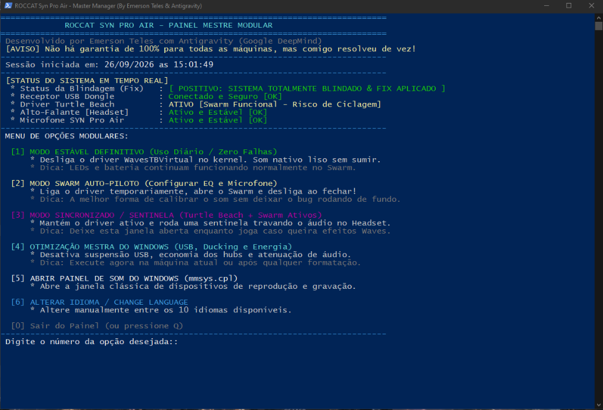

# 🎧 ROCCAT Syn Pro Air — Master Audio Manager & Definitive Fix
### Definitive Stabilization Suite, Audio Controller & Cycling Fix (Windows 10 & 11)

**🌐 Languages / Idiomas:**  
  
  
  
  

 

 
 

*Master Modular Dashboard running: real-time system shield status, driver monitoring, and 6 stabilization modes.*

---

> [!NOTE]
> **Versão em Português:** Para a documentação em Português do Brasil, consulte [README-PT-BR.md](README-PT-BR.md).

---

## 📌 1. Overview & Disclaimer

This project was born out of real-world engineering necessity: to definitively resolve the chronic disconnection, audio drops, and speaker-switching bug on the **ROCCAT Syn Pro Air** wireless gaming headset. This issue persisted for more than 3 years across more than 5 to 7 different occasions, recurring even after formatting Windows from scratch.

> [!WARNING]
> **Disclaimer:**  
> This script is **not 100% guaranteed to work on every motherboard and hardware configuration in the world**, as USB architectures, chipsets, and driver versions differ across machines. **However, for me (the author), it permanently and definitively solved the problem after years of frustration.** Use at your own discretion.

> [!IMPORTANT]
> **Authorship & Credits:**  
> Developed by **Emerson Teles**.

---

## 🛑 2. The Chronic Problem: What happens?

Owners of the **ROCCAT Syn Pro Air** (and related models such as Elo 7.1 Air or Syn Max Air) frequently experience the following cycle on Windows:

1. The headset connects normally and reproduces audio.
2. After a few seconds or minutes (~10 to 30s), audio abruptly cuts out.
3. Windows automatically redirects sound to secondary speakers (e.g., Creative 2.1 speakers, graphics card audio, or monitor).
4. Seconds later, the headset re-appears and audio attempts to switch back, creating an **infinite loop of back-and-forth toggling**.
5. When opening the **ROCCAT Swarm** software, an alert pops up:
   > *"We detected that the microphone and speakers of SYN PRO AIR are disabled. To use all headset features in SWARM, enable speakers and microphone through the Windows sound control panel."*
6. **The mystery of time:** When the computer is formatted from scratch, the headset works fine initially, but **after weeks of use, system cache accumulation, and cumulative Windows updates, the bug always returns.**

---

## 🔬 3. The Technical Reason: Why does this happen?

### A. Corporate Abandonment (ROCCAT x Turtle Beach)
* Traditional German peripheral brand **ROCCAT** was acquired by American company **Turtle Beach**, which eventually decided to **retire the ROCCAT brand name**.
* Turtle Beach released its new control suite, **Swarm II**, but **did NOT include support for the Syn Pro Air**.
* The headset was abandoned on legacy **ROCCAT Swarm 1**, with frozen firmware (v1.09) and a Turtle Beach audio driver (`WavesTBVirtual.sys`) unpatched since 2021/2022.

### B. Endpoint Conflict & The Polling Loop
* To enable software features (Waves 3D Audio, 10-band Equalizer, and mic monitoring), Swarm requires the installation of the **Turtle Beach Audio Driver**.
* This installs the kernel driver `WavesTBVirtual.sys` (`ROOT\MEDIA\0000`), creating the virtual endpoint `Headset Chat (Turtle Beach)`.
* As cumulative Windows Updates alter the core audio engine (`audiosrv.dll`, `AudioEndpointBuilder`), the legacy Turtle Beach driver loses buffer synchronization.
* The driver disables its audio endpoint to reset itself. Windows, seeing the primary headset disappear, switches audio to the Creative 2.1 speakers. Swarm detects the absence and attempts to re-enable it, generating a burst of `MMDevAPI` events (Event ID 65) every ~10 to 30 seconds.

### C. The USB Selective Suspend Trap
* Windows comes out of the box with **USB Selective Suspend ENABLED** (`0x00000001`).
* During brief moments of silence (pausing videos, loading screens), Windows cuts power to the 2.4GHz USB transmitter to save electricity, breaking the Turtle Beach driver handshake.

### D. Endpoint Resource Exhaustion (Intel vs. ASMedia)
* When the USB transmitter is plugged into USB ports controlled by secondary chipsets (such as **ASMedia** or front case ports with unpowered hubs), game controllers (DualSense, Xbox, mouse, keyboard) exhaust the controller's *periodic isochronous bandwidth resources*, triggering the Windows warning:
   > *"USB controller resources exceeded — The controller does not have enough resources for this device."*

---

## 💡 4. Discovered Tricks & Best Practices Manual

| # | Trick | Practical Technical Explanation |
| :-: | :--- | :--- |
| **1** | **Connect to Native Intel/AMD Chipset** | Plug the USB dongle directly into rear I/O USB ports soldered onto the motherboard routed to the primary chipset (Intel or AMD). Avoid front case ports or hubs shared with many peripherals. |
| **2** | **Disable USB Selective Suspend** | Use `powercfg` to force both AC and DC index values to `0x00000000` across all system power plans. |
| **3** | **Disable USB Root Hub Power Saving** | In Device Manager (`devmgmt.msc`) > Universal Serial Bus controllers > uncheck *"Allow the computer to turn off this device to save power"* on all USB Root Hubs. |
| **4** | **Set Communication Ducking to 'Do Nothing'** | In the classic Sound panel (`mmsys.cpl`) > Communications tab > select *"Do nothing"*. Prevents Windows from ducking or re-routing audio streams upon voice detection. |
| **5** | **Disable Exclusive Mode** | In Headset Properties > Advanced tab > uncheck *"Allow applications to take exclusive control of this device"*. |
| **6** | **The Swarm Autopilot Trick** | In daily use, keep Turtle Beach's kernel driver disabled (`Start = 4`). The headset runs 100% rock-solid on Microsoft's native driver with RGB lighting active in Swarm. When you want to adjust the equalizer or mic, use Option 2 to launch Swarm, and it will shut down the driver automatically when closed! |

---

## 🛠️ 5. Step-by-Step Script Menu Manual

The script automatically detects your Windows operating system language among 10 languages and displays a **Real-Time Shield Status Badge**:
* `[ ✓ POSITIVE: SYSTEM FULLY SHIELDED & FIX APPLIED ]`: Indicates that USB power, ports, and registry settings are fully protected against the bug.
* `[ ✗ PENDING: FIX NOT APPLIED OR INCOMPLETE ]`: Indicates that Option 4 should be run to apply optimizations.

### Detailed Description of Each Option:

* **`[1] Definitive Stable Mode (Daily Use / Zero Bugs)`**:
  * **What it does:** Terminates Waves background processes and sets the `WavesTBVirtual` kernel driver to disabled (`Start = 4`).
  * **Result:** The headset runs purely on Microsoft's rock-solid native driver (`usbaudio.sys`). Audio **never drops to the Creative 2.1 speakers**, and RGB/AIMO lighting continues to work normally in Swarm!
  * **When to use:** Ideal for everyday gaming, listening to music, and watching videos without worrying about audio bugs.

* **`[2] Swarm Autopilot Mode (Tune EQ & Microphone)`**:
  * **What it does:** Temporarily enables the Turtle Beach driver (`Start = 3`), starts the service, and launches ROCCAT Swarm.
  * **The Magic:** The script monitors in the background. **As soon as you finish your adjustments and close the Swarm window, the script automatically shuts down the driver!**
  * **When to use:** Whenever you want to adjust the equalizer, bass, treble, or microphone sensitivity in Swarm without leaving the bug running in your system.

* **`[3] Synchronized / Sentry Mode (Turtle Beach + Swarm Active)`**:
  * **What it does:** Keeps the Turtle Beach driver running and starts an ultra-low latency native C# sentry (`CoreAudio`) monitoring the endpoint every 500ms.
  * **Result:** If Windows or the driver attempts to divert audio to the Creative 2.1 speakers, the sentry intercepts the drop and instantly restores the headset.
  * **When to use:** Keep this window open during gaming sessions if you want real-time proprietary Waves 3D Audio effects active.

* **`[4] Windows Master Optimization (USB, Ducking & Power)`**:
  * **What it does:** Scans all Windows power schemes to disable USB Selective Suspend, removes power-saving mode from motherboard USB root hubs, and locks communication ducking to "Do Nothing".
  * **When to use:** Run once on your current Windows installation and whenever you format your computer in the future.

* **`[5] Open Windows Sound Control Panel (mmsys.cpl)`**:
  * **What it does:** Opens the classic Windows Sound dialog for inspecting Playback and Recording devices.

* **`[6] Change Language`**:
  * **What it does:** Allows manually switching the menu between the 10 supported languages (saved to `config.json`).

---

## 🌐 6. Multilingual Support (10 Native Languages)

The script automatically detects your Windows display language among 10 languages:

1. 🇧🇷 **Português (Brasil)** — `pt-BR`
2. 🇺🇸 **English (US)** — `en-US`
3. 🇪🇸 **Español** — `es-ES`
4. 🇫🇷 **Français** — `fr-FR`
5. 🇩🇪 **Deutsch** — `de-DE`
6. 🇮🇹 **Italiano** — `it-IT`
7. 🇷🇺 **Русский** — `ru-RU`
8. 🇯🇵 **日本語** — `ja-JP`
9. 🇨🇳 **简体中文** — `zh-CN`
10. 🇰🇷 **한국어** — `ko-KR`

---

## 💻 7. How to Run

* **Method 1 (Two Clicks in Command Prompt):**
  1. Double-click **`Roccat-SynPro-Manager.bat`**.
  2. Confirm the Administrator prompt (UAC).
  3. The interactive menu launches directly in the terminal.

* **Method 2 (PowerShell):**
  1. Right-click **`Roccat-SynPro-Manager.ps1`**.
  2. Select **"Run with PowerShell"**.
  3. Automatically self-elevates with Administrator rights and remains open.

---

## 🛡️ 8. Security & Integrity
* **No destructive actions:** No official Windows drivers or files are deleted or corrupted.
* **100% Transparent & Auditable:** Clean, open PowerShell and pure C# code.
* **Fully Reversible:** All settings and optimizations can be enabled, disabled, or reverted at any time directly through the menu.

---

## 👤 About the Author

Developed and maintained by **Emerson Teles** (known in the community as **Emertels**).

Passionate about technology, hardware, gaming, system maintenance, and software/emulator translation & localization into Brazilian Portuguese (PT-BR).

### 🛠️ Notable Projects & Contributions:
- **Automation Suites & GitHub Utilities:**
  - **[Suite-Emuladores](https://github.com/Emertels/Suite-Emuladores)** — Intelligent PowerShell suite for autonomous downloading and updating of 56 game emulators and frontends.
  - **[AI-Chat-Vault](https://github.com/Emertels/AI-Chat-Vault)** — Portable backup and recovery for local conversations across 20 agentic AI and coding tools.
  - **[Microsoft-Photos-Fix](https://github.com/Emertels/Microsoft-Photos-Fix)** — Advanced PowerShell & C# fix for launch route and wallpaper associations in Microsoft Photos.
  - **[Roccat-Syn-Pro-Air-Fix](https://github.com/Emertels/Roccat-Syn-Pro-Air-Fix)** — Definitive audio management, stabilization, and cycling fix suite for wireless headsets.
- **Emulation & Systems:** Creator and architect of the **[PSBBN-Translator](https://github.com/Emertels/PSBBN-Translator)** for PS2 (40 languages); localization and support for emulators including **PSBBN**, **PCSX2**, **Dolphin**, **shadPS4**, **Azahar**, and **RetroArch**.
- **Software & Utilities:** Complete 100% translation of **DSX** (DualSense X - Trusted Translator), **ASUS GPU Tweak III**, **dnGrep**, **XWidget**, and web utilities (**DualSense Tester**, **DualShock Tools**).
- **Games & Apps:** Localization of **Silent Hill 5: Homecoming**, ongoing translation for **Silent Hill 4: The Room**, and various Android & PC applications.

---

### 🌐 Connect with me & Official Communities:

